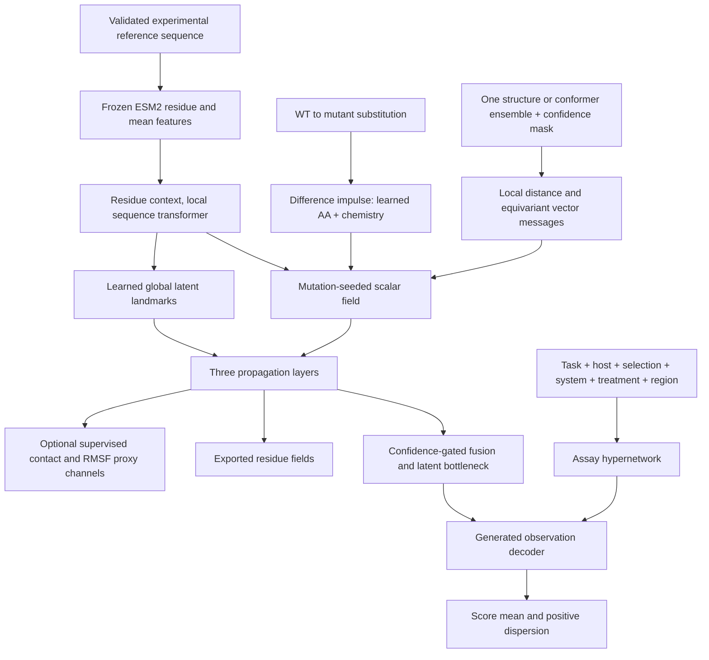

# MIPO-NDD architecture and research rationale

**V4 data update:** the original-data analysis below refers to V3. The expanded dataset now includes independent abundance/binding measurements and domain-level assays; see [V4 dataset card](v4/DATASET_CARD.md). V4 introduces `protein_reference_id` for exact construct features, retains gene-level split grouping, and downweights possible consensus/source overlap to 0.25 in the loss. “Global context” means the complete experimental reference, which may be a domain rather than a full-length protein. These data changes strengthen the experiment but do not establish mechanistic identifiability or novelty.

Prepared 2026-09-19. This document records the design decisions, evidence, tradeoffs and falsifiable research hypotheses. It is an engineering rationale, not a claim that architecture selection has already been settled by experiments.

## Objective

Predict heterogeneous experimental mutation effects on proteins excluded from supervised training. Preserve consensus, activity, fitness and stability semantics. Learn a residue-resolved mutation representation that can be tested for transfer and localized structural effects. Use the smallest implementation that can test that hypothesis on Colab.

**Proposed contribution:** a mutation-seeded, local-and-global residue response field, optionally anchored by paired WT/mutant ensemble descriptors, with a shared assay observation model generated from allowlisted experimental metadata. Evaluate under whole-gene and homology-group holdout with calibrated score uncertainty and explicit unsupported-task reporting.

This is a research hypothesis. The code is a finite graph, operator-inspired implementation; it does not establish discretization convergence, continuum neural-operator properties, causality, physical dynamics or a new state of the art.

## Evidence from the corpus changes the proposal

The source contains 31 gene/assay groups, one measurement type per gene. The 25 consensus genes contribute 86.8% of rows. HRAS is the sole activity gene; UBR5 is the sole stability construct. No abundance or binding observations remain as independent targets. There are no measured mutation perturbation fields or assay host/selection annotations beyond coarse assay categories.

Consequences:

1. Six named outputs cannot be treated as six validated biological mechanisms. The default bottleneck is eight **unnamed latent coordinates**. Unsupervised task predictions are marked exploratory.
2. Assay metadata is currently mostly unknown. With only task labels, a hypernetwork resembles a parameter-sharing task decoder. Rich observation-model transfer needs actual curated context and additional assays.
3. A free causal mechanism DAG is unidentifiable here. Do not assign folding → abundance → activity edges on the basis of these data.
4. More independent proteins and multi-assay overlaps matter more than another million variants from the same genes.
5. A compact model is appropriate: approximately 1.05M trainable parameters, not the 3M estimate from the initial sketch. Frozen ESM weights are excluded from this count.

## Architecture

### Frozen protein context

Use ESM2-650M (1,280 features/residue), frozen throughout. A 150M cache is supported for a faster feasibility run. Protein representations are cached once per exact sequence, not copied per variant. Long proteins use 768-residue overlapping windows with 128-residue overlap and tapered averaging. This is an approximation to long-range PLM context, explicitly recorded in cache metadata; the protein mean pools all cached residues.

The ±25-residue window is projected to 128 channels and processed by two four-head transformer layers. It receives relative window embeddings, never raw absolute residue position. Whole-protein mean features retain protein context without a gene-ID embedding. They can still encode protein identity; holdout evaluation remains essential.

Masked marginal LLR is computed as log p(mutant | masked WT context) − log p(WT | masked WT context). Each position needs one masked forward pass, shared by its 19 substitutions. The command checkpoints every 50 new positions. All training groups use the same newly generated cache. Missing supplied LLRs must not act as a tier identifier.

### Mutation impulse and zero-intervention constraint

For WT amino acid A and mutant B at site i:

`delta = [E(B)-E(A), chemistry(B)-chemistry(A)]`

`h_j^0 = 1[j=i] * tanh(W delta) * sigmoid(g(context_i))`

The mutation projection has no bias. Chemistry contains hydropathy, approximate residue volume, neutral-pH charge descriptor and a polar-side-chain indicator. These are scale-normalized descriptors, not energies. The complete field remains exactly zero for A→A because every propagation update is zero-preserving. This is tested; the downstream score is not forced to zero because experiments have different WT baselines.

### Local geometry and conformers

Each residue has a sparse union of spatial and sequence neighbors. Edge inputs are mean distance, distance standard deviation, average radial contact proxy, clipped relative sequence separation and mean confidence weight. Low-confidence geometry is masked from vector messages. A missing structure uses sequence neighbors and an explicit confidence mask, never invented coordinates.

For scalar message coefficient c and conformer k:

`v_i^k = sum_j c_ij * confidence_ij^k * unit(x_j^k-x_i^k)`

Rotations/reflections transform each vector field equivariantly; translation cancels in coordinate differences. Norms of the per-conformer vectors return invariant scalar features. Conformer radial features and vector norms are averaged, so coordinate frames need not be aligned for these messages. Neighbor selection pools candidates across selected conformers. The selected conformer subset is bounded by configuration.

This is **not an EGNN coordinate simulator**. It does not update coordinates, enforce conservation laws or produce mutant structures. Distances and scalar/vector messages provide E(3)-consistent geometry for supervised response learning. E(3) invariance also does not model chirality explicitly.

### Global propagation

The global path uses r=16 latent landmarks with learned residue assignment. It gathers scalar fields into landmarks and redistributes them in O(N r d) rather than O(N² d). This lets a mutation influence distant residues without three local layers having to span the whole protein.

These are learned context-based couplings. They are **not measured allostery, MSA couplings, PLM attention maps or ensemble covariance**. Comparing this path with `global_kernel=false` is the direct test of whether it improves transfer.

### Colab versus complete fields

The default graph contains at most 256 residues: the local window, nearby spatial residues and uniformly distributed protein positions. Every residue still contributes to cached whole-protein context. Exported field files include the exact selected reference positions; unsampled residues have no predicted field in this mode.

`configs/full_protein.json` sets `max_nodes=0`, preserving every residue. This is necessary for literal whole-protein field evaluation. It uses smaller batches and may require reducing hidden size or using a larger GPU. The sampled and full configurations are separate experiments, not numerically equivalent implementations. Padding uses explicit masks throughout.

### Fusion and assay observation model

Four projected inputs—local sequence/site field, mean field, global context and mutation/LLR—receive learned mixture weights with structure confidence as context. Modality dropout discourages dependence on one source. Fusion feeds an eight-dimensional tanh bottleneck.

The metadata encoder receives task and allowlisted host, selection, system, treatment and protein-region descriptors. Categorical vocabulary is fitted only on training genes. Gene names, assay IDs, protein groups, free text, disease labels and targets do not enter this encoder. Assay IDs are used solely for grouping, metadata lookup and reporting. Unknown metadata maps to zero embeddings. Task dropout trains a generic decoder fallback for unseen measurement types.

The hypernetwork generates two affine readouts of the latent state, yielding mean `mu` and `sigma = softplus(raw_sigma)+0.05`. A `fixed_heads` alternative measures whether generated decoders help. An arbitrary assay's scale cannot be inferred from absent metadata; hypernetworks do not solve unknown normalization by themselves.

## Training objective

`L = Gaussian NLL + 0.1 Huber + 0.2 within-assay ranking + 1e-5 field energy + lambda_aux masked physical Huber`

Gaussian likelihood trains mean and dispersion jointly; there is no duplicate uncertainty term. Pairwise softplus ranking compares only variants in the same gene/assay, excluding ties, self-pairs and duplicated samples. Gradient accumulation does not make cross-microbatch ranking pairs. Assay-balanced minibatches first sample a gene uniformly, then an assay, then variants, preventing very large landscapes from dominating by row count.

Consensus targets retain their supplied scale. Other tasks use training-only median/IQR scaling with a scale floor. The model never uses the unverified `train_target_0_1` column or estimates held-out assay quantiles. Prediction in score units uses the training transform. RMSE on a new assay is secondary because assay scale shifts remain unresolved; within-assay Spearman is primary. Higher numeric score is the modeled ordering; direction is not automatically interpreted as healthy, pathogenic, GoF or LoF.

### Optional physical supervision

`prepare_field_teachers.py` reads genuine paired WT/mutant structures or ensembles and produces mutation-specific changes in contact degree and aligned RMSF. Contact degree is scaled by 20; RMSF in angstroms by 5. RMSF targets require at least two conformers on both sides. The script does not create fake dynamics by jittering coordinates.

These are proxy channels, not exact ΔΔG, exposure or interface change. Training masks absent targets and only reads teachers for training genes. Default runs have no teachers and cannot attach physical meaning to these channels. Genuine ensembles can be imported as multi-model PDBs. Generating BioEmu/MD ensembles is an optional external data-production step, not silently performed during DMS training.

### Constraints intentionally excluded

- No approximate reverse-field antisymmetry for an arbitrary phenotype: the reverse mutation needs the mutant reference/background, and nonlinear activity effects need not be odd.
- No prespecified mechanism DAG or claims of causal mediation without matched perturbation experiments.
- No invented MSA, secondary structure, SASA, Grantham or interface features. The implemented feature schema is explicit.
- No PLM fine-tuning in V1; LoRA is an additional experiment after the frozen baseline succeeds.
- No cell-state prediction from this corpus: it has no cellular response targets.

## Training hierarchy and leakage boundary

The runnable default trains the existing direct corpus. The curriculum example supports generic human DMS → family teacher mixing → direct NDD specialization, with the backbone frozen only after earlier stages. Missing curriculum stages fail before training. The importer requires explicit gene, assay and evidence-tier assignments; data are never fetched merely because an assay is mentioned in a manifest.

Every supervised stage is inside the same outer split. No target-gene labels, physical teachers or checkpoint trained on that gene may enter an earlier stage. Identical reference sequences across split roles are rejected; homology groups need explicit cluster assignments. Pretrained ESM/structure/ensemble model exposure is a separate limitation: gene holdout means unseen in this supervised corpus, not guaranteed unseen by every foundation model.

## Evaluation and decision criteria

For each of 31 outer test genes, reserve a distinct validation gene and calibration gene. The remaining 28 genes train. This is stricter than the initial 24-of-25 sketch and incorporates the added genes. Keep these splits fixed across architectures and seeds. For homology tests, supply MMseqs/family clusters; the broad `protein_group` column is not a validated homology partition.

Primary metric: Spearman within assay, then average assays within gene, then genes equally. Report consensus and raw-assay groups separately, every undefined correlation, unsupported task rows and task coverage. Seed ensembles decompose predictive variance into within-model dispersion and between-seed disagreement. Empirical normalized-residual intervals use calibration genes only; exchangeability under unseen-gene shift is not guaranteed. Bootstrap genes, not variants, for aggregate confidence intervals.

Required comparisons: signed zero-shot LLR, frozen ESM MLP, ESM plus chemistry, fixed heads, no structure, no global propagation, no LLR, one conformer versus real ensembles, and the complete model. Use matched caches/splits/seeds. A full field model must beat simpler alternatives consistently across genes, not only row-weighted aggregates. Benchmark published competitors only using legitimate checkpoints/protocols without target-label leakage; this package does not pretend to reimplement them.

Perturbation maps need independent validation: withheld functional-site annotations, independently measured mutation structures, appropriate shuffled-site nulls, confidence-matched controls and results across several proteins. Physical teachers used for training cannot also count as independent explanatory validation. A plausible PTEN visualization alone is not evidence of allosteric causality.

## Novelty positioning and primary references

The initial literature screen supports treating this as a **combination and evaluation hypothesis**, not a first-ever claim. A systematic review and successful ablations remain required.

| Prior work | Relevant established idea | What this project must test beyond it |
|---|---|---|
| [PreMode, 2025](https://www.nature.com/articles/s41467-025-62318-4) | Sequence/structure context and equivariant graph reasoning for mutation mode of action | Residue-response representation with generated heterogeneous-assay readout under gene holdout |
| [SynFit, 2026](https://github.com/luo-group/SynFit) | Shared protein representations, property predictors and multi-objective fitness learning | Benefits of explicit propagation and metadata-conditioned observation transfer |
| [ProteinNPT, 2023](https://github.com/OATML-Markslab/ProteinNPT) | Protein property prediction with multi-task representations | Transfer of field representations without target-gene labels |
| [EGNN, 2021](https://proceedings.mlr.press/v139/satorras21a.html) | Efficient equivariant molecular graph computation | E(3) consistency is an inherited tool, not a novelty claim |
| [EGNO, 2024](https://arxiv.org/abs/2401.11037) | Equivariant operators for 3D dynamics trajectories | Mutation-to-DMS response fields, without claiming this code learns dynamics |
| [MoCHI, 2024](https://link.springer.com/article/10.1186/s13059-024-03444-y) | Explicit genotype-to-phenotype models and latent biophysical traits | Amortized cross-protein observation models; mechanistic identifiability still needs data |
| [BioEmu](https://github.com/microsoft/bioemu) | Generation of approximate monomer conformational ensembles | Optional inputs/teachers, with model biases and runtime documented separately |
| [ESM repository](https://github.com/facebookresearch/esm), [ProteinGym](https://github.com/OATML-Markslab/ProteinGym) | Frozen protein representations and standardized DMS references | Input provenance and experimental reference alignment remain mandatory |

If the field model loses to the ESM MLP, keep the simpler model and report the negative ablation. If it improves only closely related proteins, narrow the transfer claim. If it improves unseen-family prediction and independently predicts mutation-specific structural changes, the representation becomes a defensible scientific contribution.
